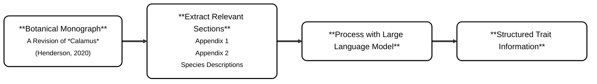

# SyzygiumTrait

## Overview
Floristic accounts require a combination of understanding the works of previous taxonomists, interpreted in light of new specimens or specimens from an area for which a new flora is being prepared. The output of this research is trait data that in the digital age is typically compiled as a database. 

However, it’s always exhausting and time-consuming for scientists to extract trait information of species from extensive articles and monographs. It would be helpful if there’s a tool that can extract, even organize this biological information automatically. 
In the era of AI, it’s possible to deal with this issue with LLM. We want to design a tool, or a universal prompt, that can organize existing descriptions into an Excel spreadsheet, to act as a baseline for taxonomic review alongside examination of additional specimens and new trait information. 

Kew Science is committed to assemble Floristic accounts of Syzygium for several southeast Asian regional Floras. This project uses digitally available taxonomic literature and Large Language Models to mobilise trait data for its use in preparation of the Flora of Singapore.

##  Material
### Code Reference
July 2025, [Amy Fiddes](https://github.com/amyfiddes)  and [Nicky Nicolson](https://github.com/nickynicolson) just finished a similar project [CalamusTraits](https://github.com/KewBridge/CalamusTraits), exploring how to use LLMs to transition between trait matrices and textual descriptions of Calamus species, with the aim of speeding up the taxonomic process. Below is a simplified flow chart to explain how Amy and Nicky extract and structure the information of Calamus.

<p align="center">Fig1. flow chart of CalamusTraits’ extraction part<p>

### Literature Sources
The original list of species for treating in the Flora of Singapore was taken from {eve to add the paper}. 
33 of these species have descriptions in two floristic accounts, these are [A revision of Syzygium](https://bioone.org/journals/adansonia/volume-37/issue-2/a2015n2a1/A-revision-of-Syzygium-Gaertn-Myrtaceae-in-Indochina-Cambodia-Laos/10.5252/a2015n2a1.full) & [Tree Flora of Sabah and Sarawak]() Protologues were accessed from the biodiversity heritage library (BHL). 


## Process
The processing LLM is OLLAMA. We took part of the Calamus script as a prototype and further modified it to fit in our material, hoping to meet universal needs, not just specific for one type of article or genus. 

The original Calamus code is highly fitted for the Calamus monograph [Henderson. 2020]. The Calamus monograph is unusual as it includes an extensive appendix (a trait matrix) with value ranking standard for each trait. Our literature resources do not include these elements. As a result, our workflow had fewer steps, as we only extracted the pure text and used the LLM to split it and fill it into corresponding cells. 

In this project, I modified the Calamus code. I deleted all functions that were too specific for the input files, preventing hard-coding. I also rewrote the prompt. The original prompt linked to custom made dictionaries for each trait (according to the matrices). Instead, my prompt returns the original content of the literature word for word (verbatim). 

## How to Run the Script

### Pre-requisites
The following instructions assume that you have cloned the repository to a machine where you have:

* A local installation of Python
* The build tool `make`
* A command line terminal program

### Set up (for the first time)
1. The scripts require connection to a LLM on a HPC cluster. Follow these instructions for installation : [LLM install on HPC](https://github.com/WFO-ID-pilots/.github/blob/main/docs/LLM-install-on-HPC.md)

2. Set up a virtual environment
   ```
   python -m venv env
   ```   
3. Activate the environment
   ```
   source env/Scripts/activate
   ```
4. Install the library
   ```
   pip install -r requirements.txt
   ```

Extra preparation if you are going to try your own material:
* Ensure to copy your source PDF file to the directory.
* In `extrac_test.py`, modify the regex (line 14 and line 24) to find your target genus correctly, then save it.
* In `run_ollama.py`, modify the PROMPT section to meet your output demand, and save it.

### Run the script
1. Activate the virtual environment
   ```
   env/Scripts/activate
   ```
2. In the directory of the project, run the extraction script:
   ```
   python extract_text.py SOURCE_FILE_NAME.pdf EXTRACTED_OUTPUT.csv
   ```
   This step extract texts in pdf and list them line by line to one csv file
   (Replace file names with your actual ones)
   
4. Connect to HPC 
5. In the directory, run the ollama execution script:
   ```
   python run_ollama.py EXTRACTED_OUTPUT.csv ORGANIZED_OUTPUT.csv
   ```
   This step use LLM to organize species’ information automatically.

   Tip: use the --model_name option to run the scripts with a different ollama model. Default is set to llama3.3

## Result
The results have not been fully manually validated, so errors may exist due to LLM extraction or source inconsistencies.

Future work should include thorough validation and integration with curated biodiversity databases.

### Automatically ignore unrelated content

CalamusTrait cleaned up all of the unrelated content (footer, header, caption etc). However, in this project, we tried to delete the cleaning function because it’s too specific for different materials. 
It turns out that, though the input text is not pure enough, OLLAMA can recognize the main points of description and extract them well. 

### Unit transformation

We notice that ollama can transform units wisely. For example, in [Sol and Parnell. 2015.], it described inflorescence length of *Syzygium abortivum* as "1.3cm to 1.5cm". In prompt, We accidently set this trait column to "mm" instead of "cm". Out of our surprise, ollama automatically transform it to "13 - 15". And it works for all of the cells we've observed.

### Redundant species and column of trait
Due to limitation of regex design, the programme sometimes catch small sentences, which include the genus name, but actually not the place where discription of a specie begins. For example, in [A revision of Syzygium](https://bioone.org/journals/adansonia/volume-37/issue-2/a2015n2a1/A-revision-of-Syzygium-Gaertn-Myrtaceae-in-Indochina-Cambodia-Laos/10.5252/a2015n2a1.full), page 196, there's a sentence saying: "1. Syzygium samarangense and S. aqueum are widely..." It's just additional note under *Syzygium aqueum*, but the programme still catch it as a description paragraph of *Syzygium samarangense* and make a row for it. In the future, maybe we should find the digging point by seperating the PDF structure or think up other way to let computer recognize it. Now we purely rely on regex and it's not so perfect.

Also, ollama will automatically create trait column that we don't need. Though it has been clearly stated in PROMPT (see line 21 in `run_ollama.py`), there are still 207 extra column generated by ollama while it processing [Tree Flora of Sabah and Sarawak](). The model is such a busybody and don't want users lose any information in the literature. Hope we 

### Same prompt, but ChatGPT doesn’t work
We also experimented the same prompt, same extracted csv file with chatGPT, to test if ChatGPT could make the similiar output as ollama did. At very begining of this project, my ChatGPT free account could deal with 5 species and return a accurate, comprehensive result. However, this little prefect result only appeared once. It's unrepeatedable. We use other account to buy ChatGPT pro (medium level), it return very few content, even whole blank sometimes. 

I personlly think it resulted from the different generate logic behind ollama and ChatGPT, and it's worth further exploration. 


